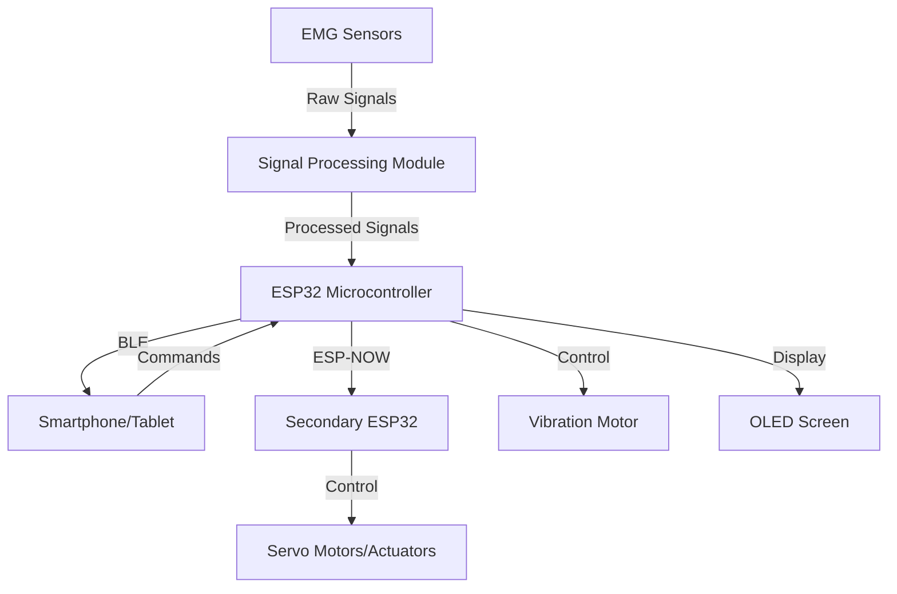
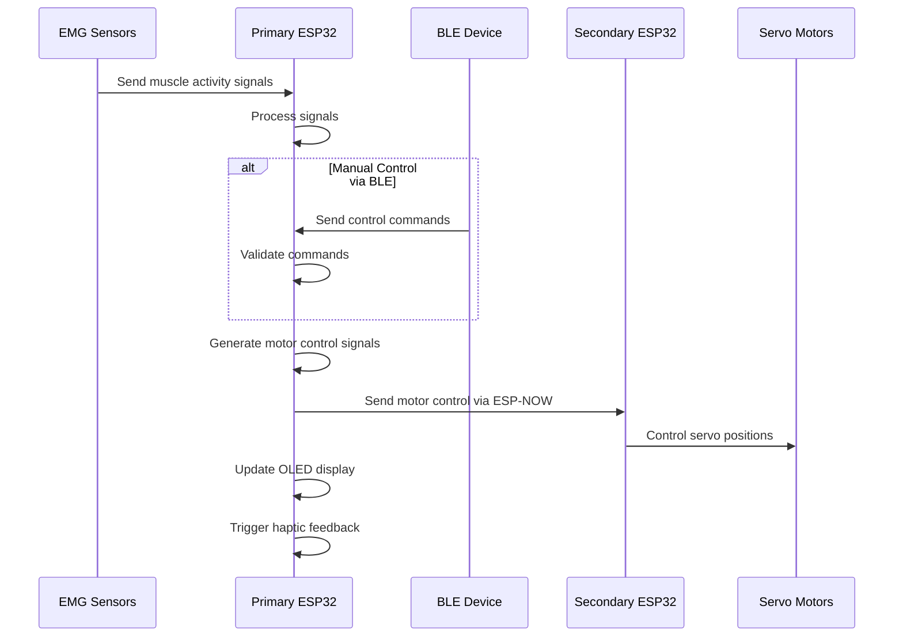
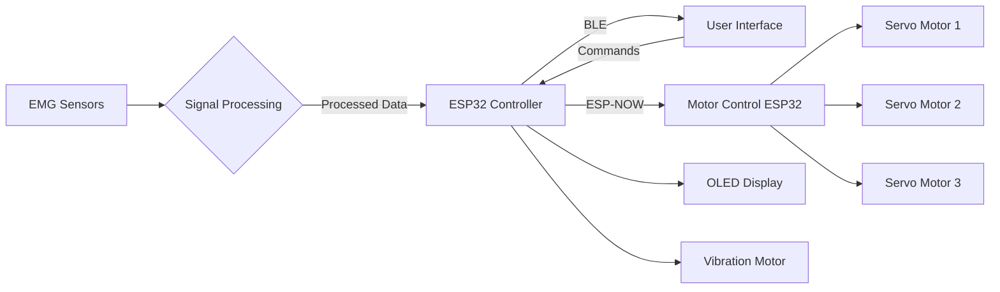

# EMG-Based Wearable Control System

This project implements a sophisticated wearable control system that processes electromyography (EMG) signals to control external devices through wireless communication. The system comprises EMG sensors, a signal processing module, and a microcontroller that communicates with actuators.

## System Overview

The system utilizes ESP32 microcontrollers to process EMG sensor data and control actuators. Key features include:

- BLE connectivity for smartphone/tablet control
- ESP-NOW wireless communication between microcontroller units
- Real-time visual feedback via OLED display
- Haptic feedback through vibration motors
- Remote control of servo motors based on muscle activity

## System Architecture

## Communication Flow

## Data Flow Diagram

## Hardware Components

- ESP32 microcontroller (Primary and Secondary)
- EMG sensors for muscle activity detection
- SSD1306 OLED display (128x64 pixels)
- Vibration motor for haptic feedback
- Servo motors for physical actuation
- Power supply circuit

## Software Features

- BLE server for wireless control
- ESP-NOW communication for low-latency device-to-device communication
- Command parsing and execution
- Real-time feedback through OLED display
- Motor control with position commands

## Usage

### BLE Commands

The system accepts the following commands via BLE:

- **Motor Control**: Format `M[1-3]:[0-180]` (e.g., `M1:90` sets motor 1 to 90 degrees)
- **Emergency Stop**: Send `STOP` to halt all motors

### ESP-NOW Messages

The system uses the following message types for ESP-NOW communication:

- `m`: Display message and optionally vibrate
- `v`: Trigger vibration only
- `o`: Override motor position
- `s`: Emergency stop all motors

## Setup and Configuration

1. Update the `receiverMacAddress` variable with your secondary ESP32's MAC address
2. Flash the code to your primary ESP32
3. Flash the corresponding receiver code (not included) to your secondary ESP32
4. Connect the hardware components according to the pin definitions in the code

## Pin Configuration

- OLED SDA: GPIO 23
- OLED SCL: GPIO 19
- Vibration Motor: GPIO 18

## Dependencies

- ESP-NOW library
- WiFi library
- Wire library
- Adafruit_GFX library
- Adafruit_SSD1306 library
- BLE device libraries
